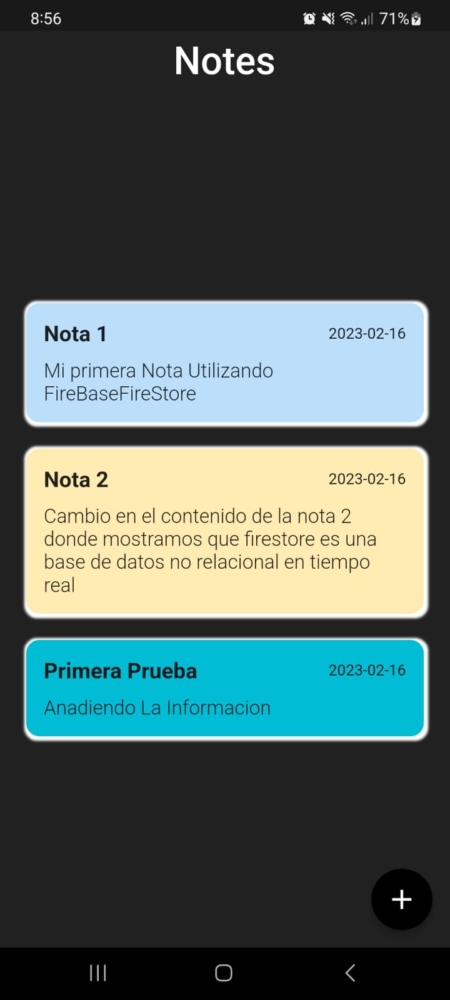
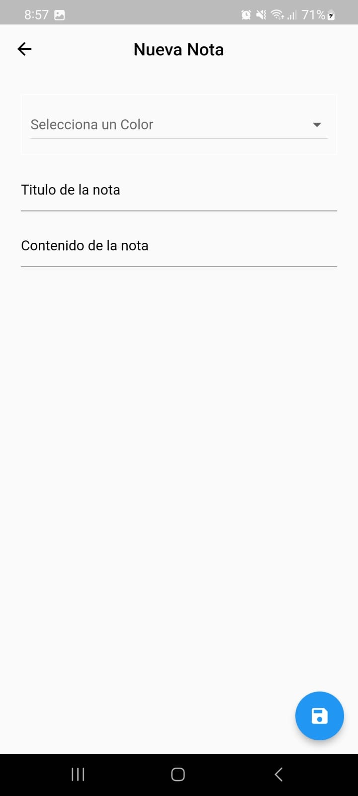
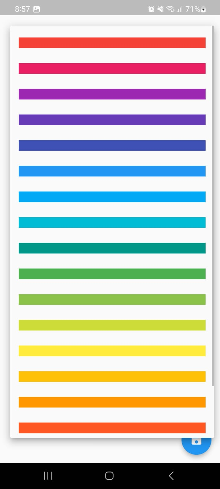
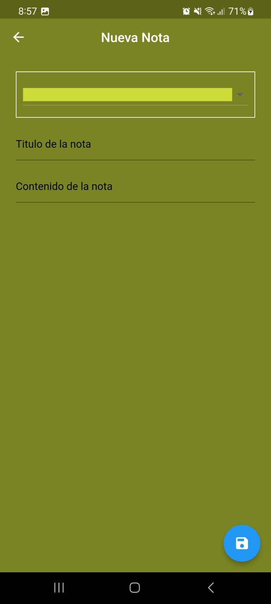
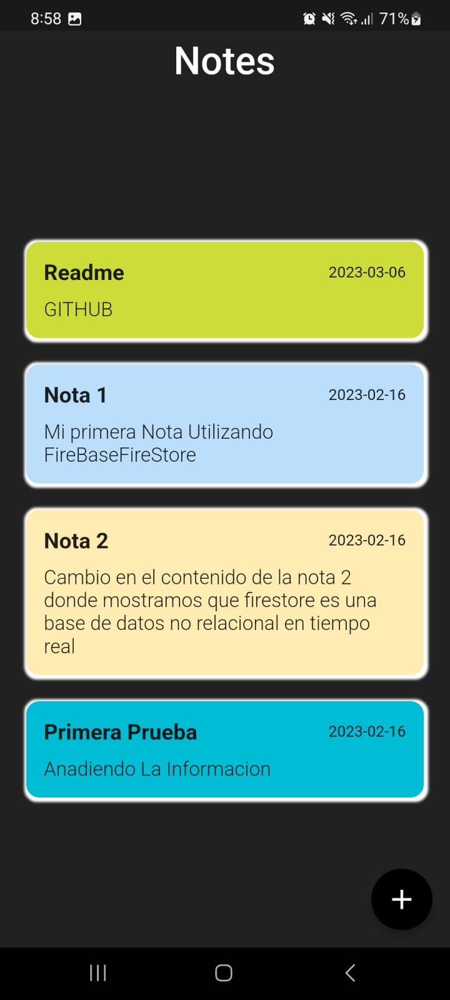

# To Do List App With FireStore

This project shows how to implement Firebase-FireStore with flutter.
I'm using cloud_firestore 4.4.1, firebase_core 2.6.0

# Running the project

1. Clone the repository

2. Open the project in your preferred IDE

3. Run the app on an emulator or physical device

# Packages

- [cloud_firestore](https://pub.dev/packages/cloud_firestore)
- [firebase_core](https://pub.dev/packages/firebase_core)
- [provider](https://pub.dev/packages/provider)